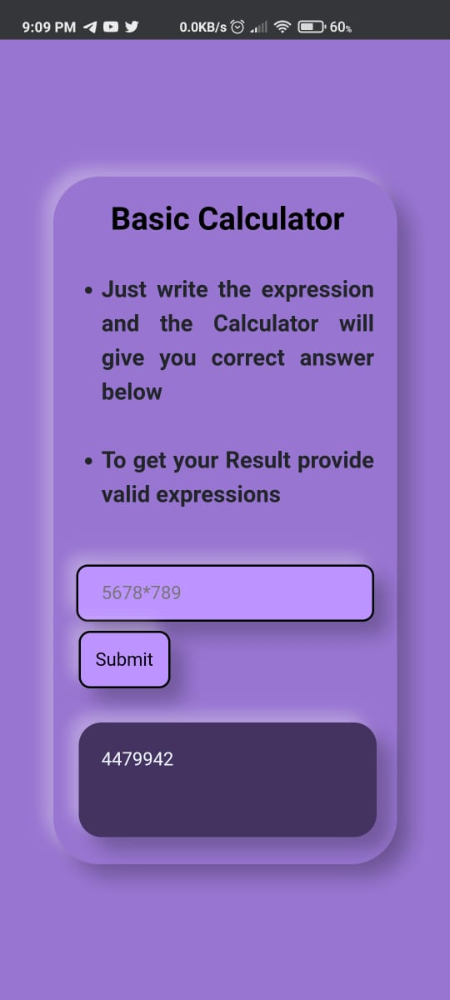

# Basic Calculator Web Application : 

[Visit the Web Application here](https://jiganesh-basic-calculator.herokuapp.com)

This Calculator is based on Django which is open-source framework used for rapid Web-Development.
The Project was built to understand workflow of Application Development and Deployment.
Thus Building small project and understanding important concepts like Responsive Web Design and Deployment makes sense.
 

This project helped me understand and apply my knowledge on HTML, CSS and Django which I have recently learned, Also I learned about heroku.
Heroku is the platform which I used to Host the Web Application on.Even Though I know about GIT and GITHUB this helped me to understand them more..

<h2>About Project</h2>

<strong>Technologies Used</strong> : 
 Django
 HTML
 CSS
 Heroku

Even though Django is backend framework and mostly used for CRUD Web Application. I used it here to understand more about it instead of Javascript. The Project wont Run on your Local Machine.

<strong>The Preview on Desktop</strong>

 

<strong>Preview on Mobile device</strong >

